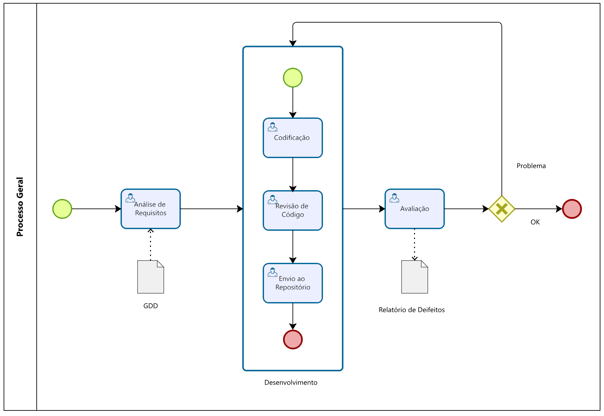

# Processo de Desenvolvimento

O desenvolvimento do jogo segue um processo iterativo composto pelas seguintes etapas:

**Análise de Requisitos**  
**Desenvolvimento**  
**Playtest / Avaliação**

Caso sejam identificados problemas, realiza-se uma etapa de correção, com ajustes de bugs, refinamento de mecânicas e melhorias na experiência do jogador.

## 1. Análise de Requisitos

A partir do GDD (Game Design Document), são extraídos os requisitos do jogo, incluindo mecânicas principais, objetivos educacionais e assets necessários (imagens, sons, personagens, cenários, etc.).

## 2. Desenvolvimento

Esta fase compreende a implementação do jogo, dividida em três etapas integradas:

### 2.1 Codificação

Implementação das funcionalidades com base nas Histórias de Usuário (HU) e nas decisões arquiteturais.

O código deve refletir as intenções de quem vai interagir com o jogo, proporcionando uma experiência coerente com os objetivos educacionais e atendendo aos critérios técnicos definidos.

Além disso, boas práticas de legibilidade, organização e versionamento são aplicadas para facilitar a continuidade do projeto e o onboarding de novos integrantes.

**Produto esperado:** código versionado, limpo e alinhado às decisões arquiteturais.

### 2.2 Revisão de Código

O código desenvolvido passa por análise de outro membro da equipe, com foco em clareza, boas práticas, consistência e possíveis melhorias.

Essa revisão não tem caráter punitivo, mas sim formativo — é um momento de aprendizado coletivo e alinhamento técnico entre os membros da equipe.

**Produto esperado:** sugestões e comentários registrados na ferramenta de versionamento (ex: GitHub/GitLab).

### 2.3 Integração ao Repositório

Após a revisão, o código é integrado ao repositório oficial do projeto, acionando, quando aplicável, uma pipeline de qualidade com etapas como build, testes e validação contínua.

Essa etapa assegura que o código está tecnicamente pronto para ser avaliado ou incorporado ao jogo de forma segura.

**Produto esperado:** código integrado com sucesso e pipeline validada (quando disponível).

## 3. Playtest / Avaliação

O jogo é executado com foco na validação da experiência do usuário. São coletados feedbacks da equipe de desenvolvimento e, quando aplicável, de usuários externos. Essa etapa permite identificar problemas de jogabilidade, usabilidade e ritmo.

Caso sejam encontrados problemas, uma nova iteração é iniciada, retornando à etapa de desenvolvimento.
